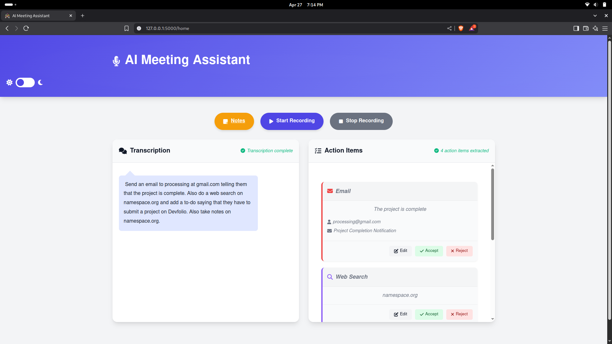
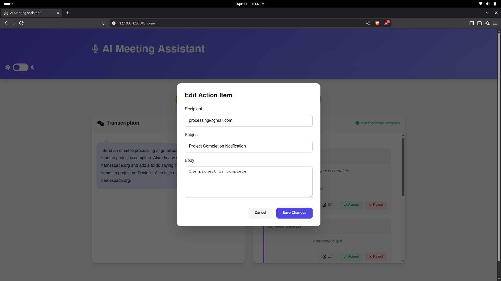
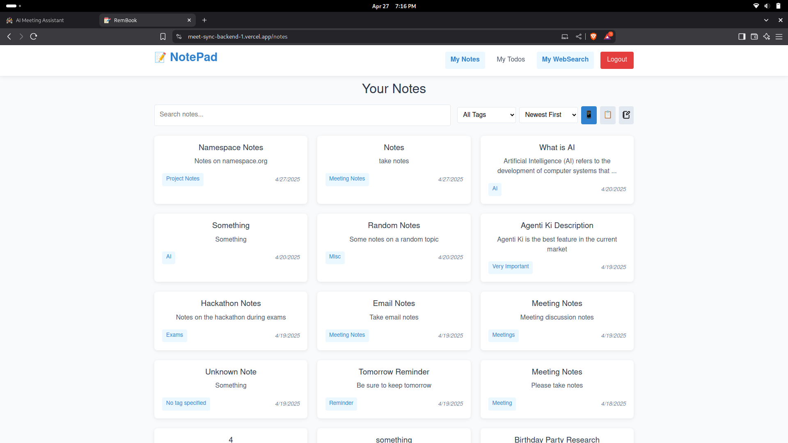
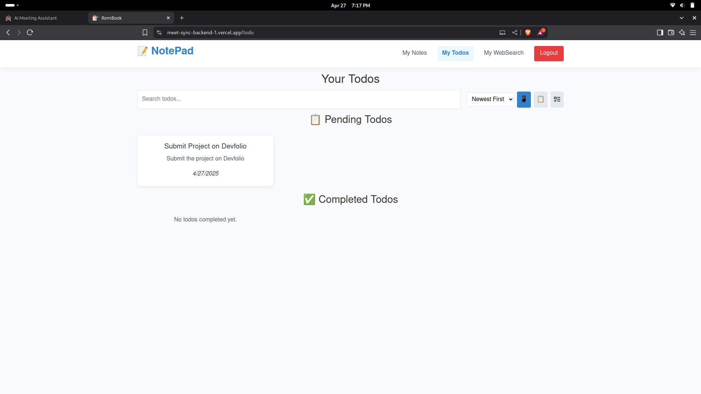
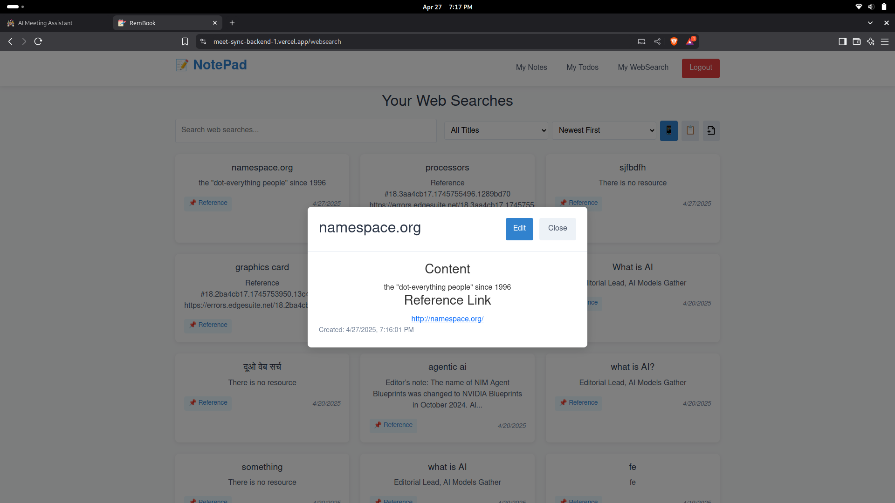

# 🚀 Project Title

Meet-Sync – An  AI chatbot for all your meeting needs

---

## 📌 Problem Statement

Problem Statement 1 - Weave AI magic with Groq

---

## 🎯 Objective

What problem does your project solve, and who does it serve? 

Meet Sync solves the problem of missed action items and inefficient meeting follow-ups by automatically recording, transcribing, and extracting key tasks from meetings. It serves professionals, teams, and organizations looking to streamline their meetings, boost productivity, and maintain control over their data. 

Briefly describe the real-world use case and the value it provides.

After a meeting, Meet Sync provides a clear list of action items — like emails, notes, to-dos, and research tasks — which users can accept, edit, or reject. Approved tasks are automated instantly, saving time, ensuring accountability, and improving overall workflow efficiency, all while preserving user privacy.

---

## 🧠 Team & Approach

### Team Name:  
Strawhats

### Team Members:  
- Yusuf Deesawala / (https://github.com/YusufDeesawala)
- Mustafa Tinwala / (https://github.com/MUSTAFA892)
- Hussain Ghantiwala / (https://github.com/HussainGhantiwala)
- Murtaza Sohangpurwala

### Your Approach:  
- Why you chose this problem?

We chose this problem because meetings are often a source of productivity loss — important decisions get lost, action items are forgotten, and manual note-taking is tedious and error-prone. We wanted to create an AI assistant that would ensure meetings become more actionable, organized, and efficient without sacrificing user privacy.

- Key challenges you addressed  

One major challenge was accurately transcribing offline meeting audio with high quality and speed. Another was reliably extracting actionable tasks from messy, real-world conversations. We also had to design a smooth system for users to review, edit, accept, or reject tasks while ensuring seamless automation and data privacy.

- Any pivots, brainstorms, or breakthroughs during hacking  

Initially, we focused only on transcription and simple task extraction. However, during brainstorming, we realized that true value comes from closing the loop — not just extracting tasks, but actually automating them. This led us to build integrations like sending emails, managing todos, and performing web searches automatically through our custom notes app, creating a full productivity workflow.

---

## 🛠️ Tech Stack

### Core Technologies Used:
- Frontend: HTML/CSS, React.js
- Backend: Flask, Javascript
- Database: MongoDB
- APIs: Groq
- Hosting: Render

### Sponsor Technologies Used (if any):
- [✅] **Groq**: We used Groq’s LLMs for two core functionalities: fast and accurate transcription of offline meeting audio, and intelligent extraction of action items such as emails, notes, todos, and web search tasks. Groq's low latency and high throughput enabled us to quickly process long recordings and generate actionable outputs with minimal delay, significantly enhancing the user experience. 
- [ ] **Monad:** _Your blockchain implementation_  
- [ ] **Fluvio:** _Real-time data handling_  
- [ ] **Base:** _AgentKit / OnchainKit / Smart Wallet usage_  
- [ ] **Screenpipe:** _Screen-based analytics or workflows_  
- [ ] **Stellar:** _Payments, identity, or token usage_

---

## ✨ Key Features

✅ **Automatic Meeting Transcription** — Record and transcribe entire offline meetings quickly and accurately using Groq’s high-speed LLMs.

✅ **Intelligent Action Item Extraction** — Automatically identify and organize actionable tasks like emails, notes, todos, and web search items from the transcription.

✅ **Task Review and Automation** — Users can accept, reject, or edit action items; accepted tasks are automated (e.g., sending emails, updating todos) instantly.

✅ **Privacy-Focused Productivity App Integration** — All tasks, notes, and todos are securely stored and managed inside a custom-built app designed for maximum privacy and productivity.

## Images






---

## 📽️ Demo & Deliverables

- **Demo Video Link:** (https://www.youtube.com/watch?v=cgGzzggmoLE)
- **Pitch Deck / PPT Link:** (https://docs.google.com/presentation/d/1UQEN2vgvajYvGGeRQzOFyJlT3JEYvoscGReGKZZFhRY/edit?usp=sharing)

---

## ✅ Tasks & Bonus Checklist

- [✅] **All members of the team completed the mandatory task - Followed at least 2 of our social channels and filled the form**   
- [✅] **All members of the team completed Bonus Task 1 - Sharing of Badges and filled the form (2 points)**  
- [ ] **All members of the team completed Bonus Task 2 - Signing up for Sprint.dev and filled the form (3 points)**  


---

## 🧪 How to Run the Project

### Requirements:
- Node.js / Python / install requirements file
- Use Groq API key
- Check env example file

### Local Setup:
```bash
python -m venv venv
source venv/bin/activate  # Linux/MacOS
venv\Scripts\activate     # Windows
```

### 3. Install Dependencies
```bash
pip install -r requirements.txt
```

### 4. Set up Environment Variables

Create a `.env` file in the project root:
```
FLASK_SECRET_KEY=<your_secret_key>
BASE_URL=<backend_base_url_for_auth>
GROQ_API=<your_groq_api_key>
APP_URL=<your_app_url>
```

### 5. Run the Application
```bash
python main.py
```

---

## 🧬 Future Scope

- 📈 **More Integrations** — Extend Meet Sync to integrate with popular task managers (like Trello, Asana, Notion) and email clients for even smoother workflows.

- 🛡️ **Security Enhancements** — Implement end-to-end encryption for audio recordings, transcriptions, and action items to further strengthen user privacy and data protection.

- 🌐 **Localization and Broader Accessibility** — Support multiple languages and add accessibility features like screen reader optimization to make Meet Sync available to a global and diverse audience.

- ⚡ **Real-time Meeting Support** — Expand from offline meetings to real-time transcription and action item extraction during live meetings.

- 🤖 **Smarter Action Item Suggestions** — Improve AI models to not only extract tasks but also suggest deadlines, assignees, and follow-up actions automatically.

---

## 📎 Resources / Credits

- **Groq API** – Transcription services  
- **Flask** – Web framework  
- **Whisper** – Speech-to-text model  
- **Instructor** – NLP-based action item extractor  

---

## 🏁 Final Words

Building Meet Sync during the hackathon was an incredible experience! One of our biggest challenges was designing a fast and reliable backend that could handle large audio files, extract meaningful action items, and automate tasks — all while keeping user data private and secure.

We learned a lot about working with Groq’s ultra-fast LLMs, optimizing audio processing workflows, and creating a smooth user experience under real-world conditions.

A fun moment was seeing the first automated email being sent out after accepting an action item — it really brought the whole project to life! 🚀

Huge shout-out to Namespace Org for organizing this amazing hackathon and providing a platform where builders like us can push boundaries, learn, and create awesome things! 🙌
---
